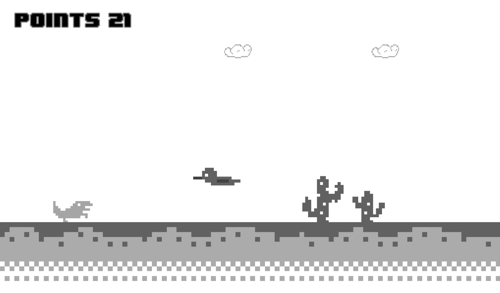
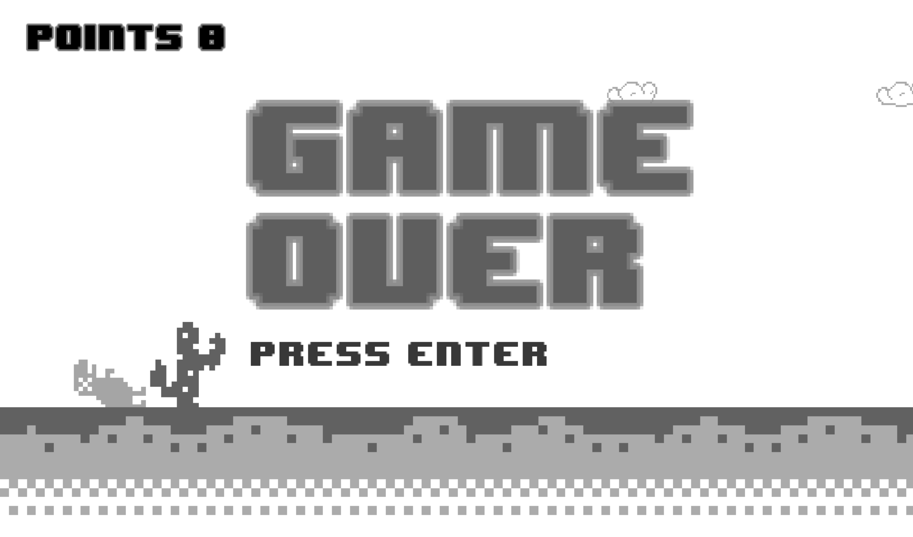

# **GOOGLE T-REX**
#### GitHub repo: https://github.com/ADOGamedev/Google_T-Rex

#### Description: This is an application made in Godot 3.3.2. It's just a recreation of Google T-Rex.

## Controls

- **Space**: jump.

- **Left Shift**: crouch (if pressed while falling, it will make you fall faster).

- **Enter**: when you die, press enter to restart.

## Screenshots

